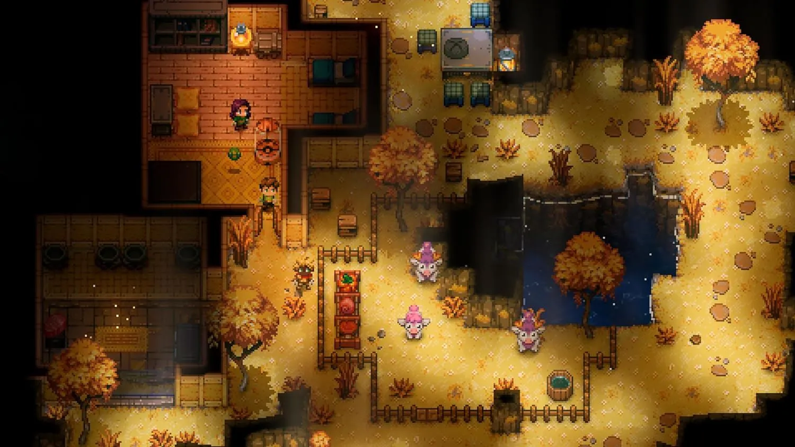

## Grid planning:
The "grid" is what makes up the "terrain" of the world.
Think of it as like, the block-layer in terraria.

Each grid-point references a string.
Eg 
```lua
grid[x y] = "mod:dirt"
```
(Don't worry, this is very efficient, since strings are interned)  
During serialization, we will want to convert this to numbers tho.


---

## idea:
Have 2 different "grid-layers", 
which serve different purposes:

- ground-grid: (ground-layer)
- main-grid: (main layer; walls, structures)


# MOD API:

```lua

umg.setCell(x,y, val)
umg.clearCell(x,y)
val = umg.getCell(x,y)

local worldX, worldY = umg.gridToWorld(gridX, gridY)
local gridX, gridY = umg.worldToGrid(worldX, worldY)

-- ground uses the same coords; its just that stuff is on the ground instead
umg.setGround(x,y, val)
val = umg.getGround(x,y)

umg.setGroundFallback("mod:dirt")
-- if ground isn't set; (ie nil,) falls back to this tile.

```


## How are cell/ground types defined?
For now, keep it simple:
```lua

umg.defineCellType("mod:dirt", {
    image = "dirt",
})

```


## We will also want chunking:
```lua

umg.CHUNK_SIZE = 32
-- chunk width/height is X units in size
-- (maybe this should be 64..? gives 4096 cells per chunk)


umg.GRID_CELL_SIZE = 32 -- grid cell size (in pixels/world coords)

local chunkX,chunkY = umg.getChunk(gridX, gridY)

umg.foreachInChunk(chunkX, chunkY, function(cell, gridX, gridY)
    if cell then
        -- cell might be `mod:dirt` or something
        print("I'm a cell inside this chunk!")
    else
        print("no cell here.")
    end
end)


umg.iterateNeighbors(gridX, gridY, function(x,y, gridX,gridY)

end)

```

For storage, don't do 2d arrays.  
Just do simple 1-d arrays, per chunk:  
```lua
grid[x + y*CHUNK_SIZE] = cell
```


## Consider dual-grid system:
Explanation video:  
https://youtu.be/jEWFSv3ivTg?feature=shared  

<br/>

The "overall objective" is to make a system for a sandbox-like gamemode.   
Core-keeper is a good example of this:




IMPORTANT NOTE:  
There's no need to write the `umg.*` API for this!!!  
That's exposed in the mod-API.  

Instead, you should just write a little self-contained module,  
like `grid.setCell(), grid.defineCellType()` etc etc.


