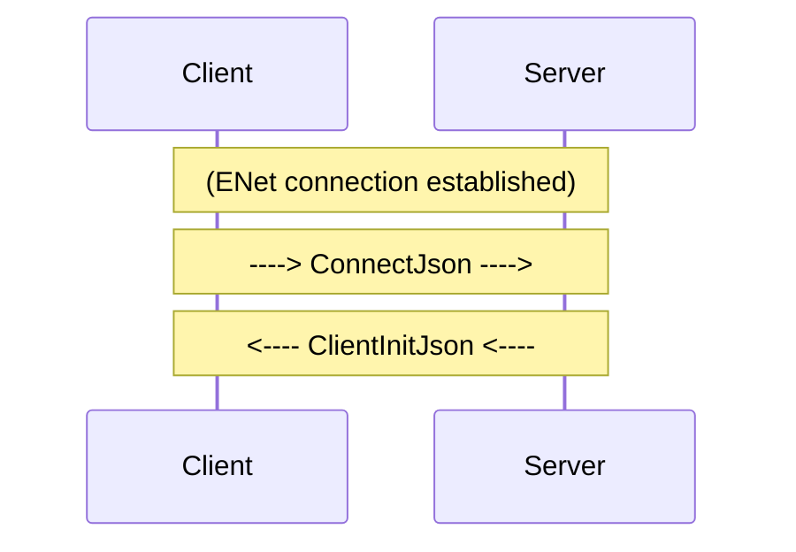

```mermaid

sequenceDiagram
    participant C as Client
    participant S as Server
    
    Note over C,S: (ENet connection established)

    Note over C,S: ----> ConnectJson ---->

    Note over C,S: <---- ClientInitJson <----

```

